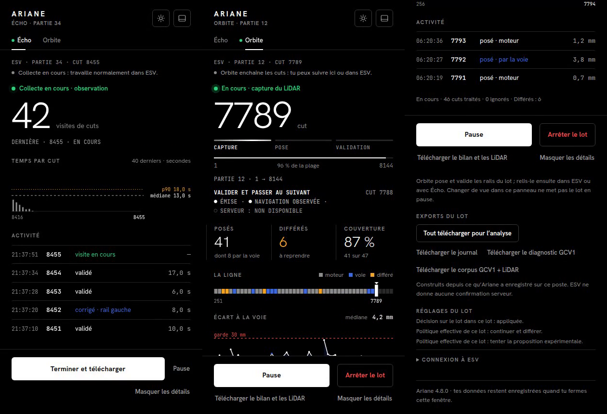
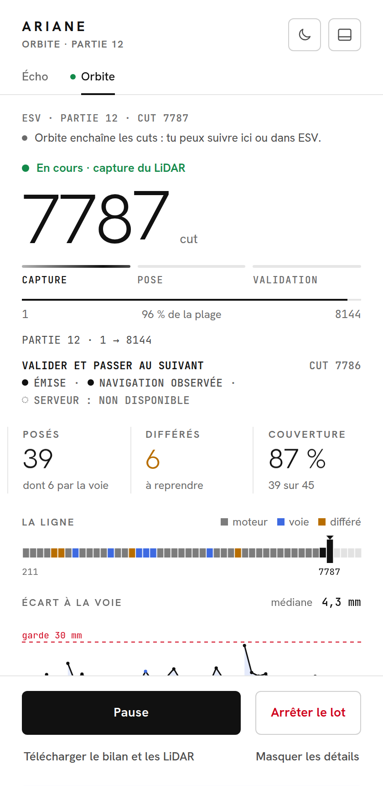

# Audit indépendant de qualité globale — Ariane 4.8.0

28 septembre 2026. Branche : `audit/qualite-480`.

## 1. Synthèse

- **Code :** protections et essais substantiels ; architecture devenue difficile à faire évoluer autour du moteur épinglé.
- **Performances :** cycle p12 médian 8,264 s ; la commande de capture domine, sans attribution démontrée de tout ce temps à ESV.
- **Données :** C1 **84/106 = 79,2 %**, **2 faux / 84 jugés** et rapport de sortie reproduits ; la couverture du panneau utilise un autre dénominateur.
- **UX/UI :** hiérarchie lisible et modes bien distingués dans le matériel fourni ; erreurs d'export et transition vers Écho à clarifier.
- **Évolutivité :** les mutations d'état et enveloppes dans `background.js` rendent coûteux un changement transversal ; extraction de responsabilités recommandée en 4.9.
- **P1 :** le vidage automatique d'Écho purge les nuages sans preuve de téléchargement réussi ; reproduction avec téléchargement non abouti simulé.
- **Verdict :** corriger ou neutraliser ce chemin de purge avant la sortie ; aucun changement de règle métier demandé.
- **Limites :** aucune session réelle 4.8.0 ; aucune mesure mémoire longue durée ni certification de fluidité ESV ; pas de nouveau rendu Chromium obtenu dans cet environnement.

### Périmètre et preuves

**Code VÉRIFIÉ :** tête demandée `9ab18e7d1a98b87748305fe1441a02ce30e45889`, branche créée depuis ce commit. Données : `046d68b4e24ffeead7d7632ad7a2837bdbbc2f63`, branche `claude/banane-47-gate-audit-vaktr1`.

Paquet : SHA-256 `d38742903b9ecaf3910ec34846cdc72b6ba1646586a1b549fad54c6e1b1fe58f`. **38 fichiers runtime** comparés octet par octet au ZIP : **0 différence** ; documents de passation et vérification différents, comme annoncé. Résultat : [paquet.json](qualite-480/paquet.json). La construction reproductible et le chargement Chromium annoncés par l'équipe ne sont pas revendiqués comme refaits ici.

Les documents demandés ont été consultés, y compris D-038/040/048, D-053–058, KI-059–063 et les trois audits antérieurs. Le présent audit n'ouvre pas à nouveau les défauts de placement déjà traités par ces audits. Il respecte le contrat métier et la décision D-058 de retenir 79 %, ainsi que D-057 sur C4/P2. Aucun code de production ni fichier gelé n'est modifié.

**VÉRIFIÉ** distingue ci-dessous : lecture de code, exécution Node/DOM simulé, recalcul d'exports terrain anciens, inspection du matériel visuel fourni. **SUPPOSÉ** signifie que l'effet réel reste à mesurer. Une reproduction simulée n'est jamais qualifiée de perte ou de ralentissement déjà observé chez l'opérateur.

Banc initial : `node tools/verify.cjs` → **855 essais, 853 passés, 0 échec, 2 ignorés** (corpus privé absent), syntaxe de 37 fichiers vérifiée, empreintes gelées conformes. Les cinq nouveaux essais caractérisent les défauts actuels : leur succès ne signifie pas qu'ils sont corrigés. Banc final : **860 essais, 858 passés, 0 échec, 2 ignorés**. Le résultat est joint dans `qualite-480/verification-finale.txt`.

### Commandes de reproduction

Depuis le dépôt code, avec le dépôt données à côté ; `KIT` et `X` désignent les chemins propres à l'audit :

```sh
KIT=../banane-data/travail/2026-09-28_kit-audit-480
X=../mesures-480
python3 "$KIT/extraire.py" "$X" p12-lot-4720 p12-relecture
node --max-old-space-size=12000 tools/acceptance-report.cjs --lot "$X/p12-lot-4720=p12" --relecture "$X/p12-relecture" --json /tmp/acceptance-p12.json
node tools/sortie-report.cjs audit/sortie-4.8-lots.json /tmp/sortie-480.md
cmp /tmp/sortie-480.md audit/rapport-sortie-4.8.md
node tools/audit-qualite-480.cjs "$KIT" /tmp/qualite-480.json
node --max-old-space-size=12000 tools/audit-calcul-480.cjs "$X/p12-lot-4720" /tmp/calcul-480.json
node --test --test-timeout=10000 tests/audit-qualite-480.test.cjs
node tools/verify.cjs
```

Extraction réalisée : p12 lot, **6 fichiers / 207 Mio** ; relecture, **2 fichiers / 69 Mio**. Les fichiers `acceptance-p12.json` et `mesures.json` joints portent les sorties et conditions. Les archives brutes n'ont pas été modifiées. Les six jeux avec journal ou bilan sont mesurés ; p9-4.7.18 n'a pas de journal dans le kit et ne reçoit pas de temps inventé. Les bilans p13 et p14 se recouvrent : jamais additionnés comme sessions indépendantes.

## 2. Qualité du code

### C02 — Les essais de panneau ne garantissent pas l'intégration DOM réelle — P2, M

**Problème →** Plusieurs harnais fabriquent un élément pour tout identifiant demandé et rendent `querySelectorAll` vide. Un élément supprimé du HTML, une cascade CSS ou un ordre de focus incorrect peuvent rester invisibles.

**Preuve VÉRIFIÉE →** `tests/panel-4800.test.cjs:10–25`, `tests/panel-h.test.cjs:9–23`, `tests/panel-policies.test.cjs:24–39`. `tests/package.test.cjs:10` vérifie des identifiants et la version, pas les interactions. `tests/geometry-brain.test.cjs:178–180` vérifie même une expression littérale du moteur. Commandes : `node tools/verify.cjs` et `rg -n 'getElementById|querySelectorAll|includes' tests/panel-4800.test.cjs tests/package.test.cjs tests/geometry-brain.test.cjs`. Le banc initial passe malgré D02, D03 et U01 ci-dessous.

**Conséquence →** Une partie du signal vert porte sur la logique simulée ou la présence de texte. **Lire les sources n'est pas en soi un défaut** : nombre de tests les exécutent réellement en VM, et les empreintes gelées sont un contrôle volontaire. Il ne faut donc pas classer tous ces essais comme textuels.

**Amélioration proposée →** Ajouter une petite suite sur le vrai `panel.html` : démarrage déconnecté, reprise manuelle → Écho, fin de lot, export incomplet, clavier et mouvement réduit. Tester téléchargement interrompu/refusé et vraie persistance séparément. Dédupliquer les harnais progressivement ; ne pas réécrire les 855 essais.

**Effort →** M. **Priorité →** P2.

### C01 — Des responsabilités transversales concentrées dans le service worker — P3, L

**Problème →** Le gel du moteur est respecté, mais son comportement effectif est réparti entre ses méthodes, la substitution de géométrie au chargement, plusieurs enveloppes et des mutations directes de `engine.s.batch`. Le contrat de chaque frontière n'est pas suffisamment explicite pour une évolution indépendante.

**Preuve VÉRIFIÉE →** `background.js:1–16` impose l'ordre de chargement ; `src/gcv1-shadow.js:6–11` remplace la globale de géométrie ; `background.js:78–89,136–165,325–406` enveloppe `apply`, `validateAndNext`, `state`, `event` et `analyze`. `background.js:237–251,312–320` réécrit repère, étape, état et fin de lot. Commande : `node tools/audit-qualite-480.cjs "$KIT" /tmp/qualite-480.json`, champ `structure` ; fichiers sources de 754 lignes (`background.js`), 914 (`panel.js`), 1101 (`engine.js`), souvent plusieurs opérations par ligne. Ces tailles situent le périmètre, elles ne constituent pas un score de qualité.

**Conséquence →** Un changement de reprise ou de fin de lot exige de comprendre plusieurs couches. Le risque de régression est une **inférence de maintenance**, pas une nouvelle erreur ESV démontrée. L'absence d'accès privé à ESV accentue le coût de validation.

**Amélioration proposée →** Formaliser les contrats état/commande/résultat ; extraire un coordinateur de lot et un adaptateur de reprise avec transitions nommées. Conserver des essais de bout en bout des enveloppes avant toute extraction. Une évolution ultérieure du gel relève de la direction, pas de cet audit.

**Effort →** L. **Priorité →** P3, 4.9.

### Points solides vérifiés

- La frontière moteur/décision est identifiable : décision et traduction en commandes sont dans `src/lot-decision.js`, avec garde finale conservée par le moteur.
- Les essais d'ordre de chargement, de réconciliation, de navigation et de reprise existent ; ce n'est pas seulement une collection de tests de texte.
- `src/bridge.js:1,48–81` borne les attentes et retire les requêtes terminées ; les annulations sont ciblées.
- `src/adapter-page.js:607–615` observe le label et retire observateur/listeners ; `src/native-page.js:260–268` nettoie le timer à l'arrêt. **Aucune fuite de listeners démontrée.**
- L'extension utilise des scripts et polices embarqués, des permissions limitées à l'hôte ESV et aucune nouvelle dépendance dans cet audit. `unlimitedStorage` est présent : les mesures de taille ci-dessous ne démontrent pas un dépassement d'un quota fixe de 10 Mio.

## 3. Performances

### P01 — Copier l'état complet avant de l'alléger pénalise la montée en charge — P2 pour projection, P3 pour stockage ; M/L

**Problème →** La vue du panneau retire les gros enregistrements **après** leur copie. Chaque événement sauvegarde aussi l'état complet. Cela peut amplifier le coût avec le nombre de cuts.

**Preuve VÉRIFIÉE →** `src/engine.js:104–114` : `view()` et `save()` clonent `this.s`, puis `event()` sauvegarde. `background.js:538–546,571` : `panelView` retire `records`, `incomplete` et `lotPosed` seulement après `engine.view()`. `panel.js:908` demande la vue chaque seconde. `src/storage.js:10` écrit l'état via `chrome.storage.local`.

Commande : `node tools/audit-qualite-480.cjs "$KIT" /tmp/qualite-480.json`, champ `copies`. Conditions : Linux x64, Node v24.19.0, processeur déclaré Intel Xeon Platinum 8573C ; quatre appels par taille, état reconstitué depuis l'export p12, puis tableaux agrandis synthétiquement. Le relevé JSON fait foi pour les temps exacts.

| Charge | Nature | Taille JSON de l'état | Ordre de grandeur d'un `view()` |
|---|---|---:|---:|
| 106 cuts | Reconstitution p12 avec ses enregistrements exportés | 1,45 Mo | une dizaine de ms |
| 1 000 cuts | Synthétique, proportions p12 | 11,9 Mo | environ 0,12 s |
| 8 000 cuts | Synthétique, proportions p12 | 94,2 Mo | environ 1,1 s |

**Conséquence →** Le coût de copie est **VÉRIFIÉ sous Node**, pas une durée de rendu Edge. L'aggravation de la latence des boutons et des écritures sur un vrai lot long est **SUPPOSÉE**. Le processus concerné par `engine.view()` est le service worker, pas directement le fil principal d'ESV. Une partie de 8 000 numéros n'est pas nécessairement 8 000 cuts à traiter : p12 n'en contient que 106.

**Amélioration proposée →** Construire la projection légère avant de copier (P2/M), puis sortir les historiques volumineux de l'état sauvegardé et utiliser des enregistrements incrémentaux (P3/L). Mesurer latence `view`, durée `setState`, octets écrits et accusé Pause à 100/1 000/8 000 cuts effectivement traités avant de choisir le seuil.

### P02 — La mesure « analyse » ne comprend pas toute la décision — P2, S

**Problème →** Le commentaire de `perf-lot.cjs` annonce moteur, décision et écritures incluses ; l'intervalle mesuré s'arrête à `proposed`, avant la décision sur le lot.

**Preuve VÉRIFIÉE →** `tools/perf-lot.cjs:17–19,59–63`, `src/engine.js:164–172`, `background.js:352–394`. Commande : `node --test --test-timeout=10000 tests/audit-qualite-480.test.cjs` : scénario 0 ms `before-captured`, 100 ms `proposed`, 500 ms `gcv1-shadow-observed` → `analyseMs=100`, `decisionMs=400`.

Sur p12 : intervalle existant **372 / 593 ms** (médiane/p90), intervalle jusqu'à `gcv1-shadow-observed` **512 / 861 ms**, maximum **4 254 ms** ; 106 mesures. Champ `p12AnalyseAvecDecision` de `mesures.json`. Le second intervalle ne prétend pas inclure la persistance finale de cet événement.

**Conséquence →** Attribution incomplète du temps Ariane si l'on présente 372 ms comme toute l'analyse. Les médianes séparées ne s'additionnent pas pour reconstituer une médiane totale.

**Amélioration proposée →** Renommer les intervalles ; instrumenter explicitement calcul GCV1, décision, lectures IndexedDB et sauvegardes avec un identifiant de capture commun.

**Effort →** S. **Priorité →** P2.

### P03 — Double calcul conservé pour comparaison : coût réel mais secondaire dans l'échantillon — P3, M

**Problème →** Même en Orbite GCV1, la composition calcule V4.6 puis GCV1. La capture est aussi relue pour l'analyse, l'observation de lot et la traduction de commande.

**Preuve VÉRIFIÉE →** `src/gcv1-shadow.js:565–585`, `src/engine.js:169`, `background.js:427,453`. Commande : `node tools/audit-calcul-480.cjs "$X/p12-lot-4720" /tmp/calcul-480.json`. Cinq captures p12 (1, 210, 7738, 7743, 7852), trois répétitions chacune ; 3 338 à 5 637 points ; mêmes conditions Node que P01. Les **15 sélections sont GCV1**. V4.6 prend **14 à 48 ms**, ensemble V4.6 + GCV1 **147 à 597 ms**. [Mesure complète](qualite-480/calcul.json).

**Conséquence →** Coût payé pour une comparaison qui n'est pas le placement commandé. Ce n'est **pas** l'explication des 5–6 secondes de capture. Aucun gain navigateur extrapolé depuis ces cinq captures.

**Amélioration proposée →** En 4.9, décider si la comparaison reste systématique ou devient échantillonnée ; garder la provenance. Passer la capture immuable entre étapes plutôt que la relire, après mesure du coût IndexedDB réel. Toute évolution du module gelé demande une décision distincte.

**Effort →** M pour conception et mesure, hors éventuelle levée du gel. **Priorité →** P3.

### Mesures terrain reproduites et limites d'attribution

Commande commune : `node tools/audit-qualite-480.cjs "$KIT" /tmp/qualite-480.json`. Les durées ci-dessous sont celles du poste opérateur dans les exports 4.7.x ; configuration matérielle et version exacte d'Edge **non consignées dans le kit**.

| Export | Cycle médiane / p90 | Capture médiane / p90 / maximum | n captures |
|---|---:|---:|---:|
| p12 4.7.20 | 8,264 / 9,778 s | 5,712 / 6,430 / 10,051 s | 106 |
| p11 4.7.20 | 8,533 / 9,722 s | 6,055 / 6,784 / 7,534 s | 97 |
| p9 différés 4.7.19 | 9,777 / 11,791 s | 5,651 / 7,671 / 9,143 s | 86 |
| p6 4.7.19 | 13,269 / 32,968 s | 5,167 / 6,651 / 8,195 s | 125 |
| bilan p14 incluant p13, 4.7.21 | 9,929 / 17,383 s | 4,645 / 9,043 / 29,992 s | 274 |

La commande « capture » inclut sélection, stabilisation, lecture, fusion et transfert : `src/adapter-page.js:233–265`. Ariane impose elle-même une attente de stabilité. Le temps du bridge ne sépare donc pas coût ESV et coût Ariane. Les cycles >60 s sont écartés par l'outil ; les pauses/revisites plus courtes peuvent rester. Ces chiffres ne sont pas une comparaison avant/après 4.8.0.

**Stockage/export :** `src/storage.js:24` utilise `getAll`, et `panel.js:855–885` relit tous les événements pour plusieurs exports. La segmentation limite les nuages assemblés par segment, **pas** les métadonnées chargées ou répétées (`panel.js:563–590`). KI-044 le dit déjà ; KI-060 corrige les dictionnaires, pas ce coût. Aucun pic mémoire quantifié ici : prévoir curseurs/pagination et manifeste commun en P3/L, après mesure réelle ; pas de nouvelle panne revendiquée.

## 4. Données et résultats

### D01 — Purge automatique avant preuve de téléchargement : risque de perte — P1, S/M

**Problème →** Écho considère un nuage comme exporté puis le supprime après un simple `a.click()`. Il ne reçoit aucun résultat de téléchargement ni preuve de fin d'écriture du fichier.

**Preuve VÉRIFIÉE (code et simulation) →** `panel.js:516` : `saveBlob` déclenche le lien et retourne immédiatement. `panel.js:590–621` remplit `acked` ; `panel.js:775–787` envoie ces identifiants à `native-export-ack`. `background.js:584` route vers `ackExported` ; `src/native-session.js:567–589` appelle `deleteCloud` ; `src/settings.js:163` active `releaseAfterExport:true`.

Commande : `node --test --test-timeout=10000 tests/audit-qualite-480.test.cjs`, dernier test. Il exécute **le vrai panneau et la vraie méthode `Sessions.ackExported`**, avec DOM et stockage simulés. Le lien n'enregistre aucun fichier, ne lève pas d'erreur ; résultat : **1 Blob demandé, acquittement envoyé, nuage absent du store, identifiant dans `releasedCloudIds`**. Sortie [tests-cibles.txt](qualite-480/tests-cibles.txt). Ce n'est pas un échec inventé dans la méthode de purge.

**Conséquence →** Si le navigateur bloque/refuse/interrompt le téléchargement, la seule copie locale peut être purgée. Le manifeste et la fusion peuvent **détecter** ensuite le manque, mais ne récupèrent pas les points. Une perte déjà survenue chez l'opérateur est **SUPPOSÉE**, pas observée. La possibilité d'un refus de téléchargements multiples est d'ailleurs annoncée dans `LIRE_EN_PREMIER.md`.

**Amélioration proposée →** Avant sortie, conserver les nuages tant que le téléchargement n'est pas confirmé (neutralisation de la purge : S, avec surveillance du volume), ou lier la purge à un état `complete` vérifiable du téléchargement avec gestion d'interruption (M, permissions et flux à concevoir). Ne pas remplacer cette preuve par un délai fixe. Essai d'acceptation : refus, interruption, disque indisponible simulé → nuage toujours réexportable.

**Effort →** S pour mitigation, M pour mécanisme complet. **Priorité →** P1. Ne touche pas au placement ; affecte la fiabilité des références humaines et des données collectées.

### D02 — « Couverture » du panneau et C1 ne portent pas sur le même ensemble — P2, S

**Problème →** La tuile divise par les seuls résultats finalisés, sans inclure le dernier cut laissé sans décision ni les inconnus. Le nom ne le précise pas.

**Preuve VÉRIFIÉE →** `panel.js:423–429`, `tools/acceptance-report.cjs:153–172` et définition D-038. Commande du relevé qualité, champ `panneauP12` : vrai état p12 → **84 posés, 21 différés, Couverture 80 %, 84 sur 105**. L'acceptation donne **84/106 = 79,2 %**. La séquence contient 106 cuts ; 8144 reste sans commande dans `stoppedAtEnd`. Test minimal : 1 posé, 1 différé, dernier cut non résolu → panneau `1 sur 2` au lieu de C1 `1 sur 3`.

**Conséquence →** L'opérateur et l'analyste peuvent comparer à tort deux indicateurs sous le même nom. Il ne s'agit pas seulement d'arrondir 79,2 %. Le résultat de sortie reste exact.

**Amélioration proposée →** Partager la définition du dénominateur ou nommer explicitement « sur les cuts finalisés » et montrer aussi les non classés. En fin de lot, aligner le bilan visible avec C1 et son nombre de cuts distincts.

**Effort →** S. **Priorité →** P2.

### D03 — L'export groupé masque l'incomplétude du corpus — P2, S

**Problème →** `exporterCorpus` signale des captures absentes, puis l'action groupée écrase ce message par un succès global.

**Preuve VÉRIFIÉE (DOM simulé) →** `panel.js:878–891`. Le deuxième test et `mesures.json#/exportIncomplet` donnent successivement « 1 capture(s) ... absentes du store » puis **« Tout est téléchargé : journal, bilan, diagnostic et corpus »**. Quatre Blobs sont demandés ; aucun fichier écrit n'est attesté par ce harnais.

**Conséquence →** Un dossier incomplet paraît prêt à envoyer. Ce défaut de message est distinct de la purge D01 : ici, aucun effacement n'est nécessaire pour reproduire le problème.

**Amélioration proposée →** Renvoyer un résultat structuré par export et afficher un bilan persistant : demandés, confirmés, manquants, erreurs. Conserver les avertissements de corpus dans le statut final.

**Effort →** S. **Priorité →** P2.

### D04 — Le rapport est reproductible, mais certains statuts restent des décisions déclaratives — P3, M

**Problème →** Le rapport de sortie agrège des rapports préexistants ; il ne recalcule pas les bruts. Le cumul p9 vient du manifeste ; C5 se fonde sur la présence de bilans listés. Une reproduction à l'identique ne certifie pas chaque étude citée.

**Preuve VÉRIFIÉE →** `tools/sortie-report.cjs:1–65`, `audit/sortie-4.8-lots.json`. Commande `node tools/sortie-report.cjs ...` puis `cmp` → **code 0, fichier identique**. Sorties : C1 tenu, C2 publié sans plancher, C3 tenu, C4 tenu (faux isolés expliqués), C5 bilans tenus. Le texte généré mentionne encore un « rafraîchissement automatique » alors que D-058 a retenu F5 manuel (`audit/rapport-sortie-4.8.md`, section manques).

**Conséquence →** La provenance doit distinguer résultat recalculé, résultat importé et décision de direction. Le seuil de 79 % adopté après les observations n'est pas un seuil fixé avant validation ; cela ne l'invalide pas comme décision produit, mais limite la portée de l'affirmation de performance. C2 n'est pas une précision indépendante de l'opérateur.

**Amélioration proposée →** Attacher aux entrées du manifeste commit, empreintes des sources, commande et périmètre ; valider les champs requis ; corriger le texte F5 obsolète (S/P2). En 4.9, réserver la nouvelle partie avant réglage et conserver un registre de rotation immuable. Pas de remise en cause de D-057/058.

**Effort →** M pour traçabilité automatisée. **Priorité →** P3.

### Ce qui est reproduit pour p12

[Rapport JSON](qualite-480/acceptance-p12.json), [sortie de commande](qualite-480/acceptance-p12.txt) :

| Mesure | Résultat |
|---|---:|
| Cuts distincts / appliqués | 106 / 84 |
| C1 | 79,2 % |
| Appliqués jugés | 84/84 |
| Acceptés sans retouche / validés après retouche | 79 / 5 |
| Faux (>10 mm latéral ou vertical) | 2 : 7738, 7743 |
| Paires refusées / hors contrat appliquées | 8 / 0 |
| C2 latéral médiane / p90, 10 rails retouchés | 2,205 / 8,331 mm |
| C2 vertical médiane / p90, 10 rails retouchés | 3,845 / 9,231 mm |
| Vérification du repère translaté | 106/106 |
| P2 / exclusions p12 | Non mesuré / 0 |

Le juge respecte la distinction D-040 : acceptation sans retouche pour C4, seuls cuts validés pour C2. Les références sont jointes après la décision ; les visites ne deviennent pas artificiellement des cuts indépendants. Ce recalcul utilise les observations consignées : **il ne revendique pas un nouveau rejeu des 633 décisions ni une parité intégrale**. Les 4 faux/161 jugés du rapport de sortie sont reproduits par agrégation, pas tous réévalués depuis les archives p9. La généralisation à d'autres opérateurs et parties reste à établir.

## 5. UX/UI

### Matériel et parcours inspectés

Captures fournies, datées du 27/09 dans leur README, au commit données fixé ; vrais fichiers `panel.html/js/css`, API Chrome simulée. Panneau de 420×860 pixels CSS, captures 2×. Vidéo de **32 secondes**, frames extraites à **00:05, 00:12 et 00:21**, inspectées ici. Écho y est entièrement simulé ; Orbite reprend un journal p12. Ce n'est **pas** une session ESV.





| Étape | État de l'examen |
|---|---|
| 1. Installer et connecter | Consignes et code lus ; installation interactive/connexion réelle non exécutées. Connexion absente de l'accueil, disponible dans chaque mode. |
| 2. Choisir Écho ou Orbite | Captures clair/sombre : rôles explicites, une fenêtre et deux vues ; compréhensible. |
| 3. Observer dans Écho | Vidéo 00:05 : compteur de visites, activité et pause lisibles ; santé détaillée non validée visuellement sur une vraie collecte. |
| 4. Démarrer et suivre Orbite | Vidéo 00:12 : cut, étape et Pause/Arrêter visibles ; lancement réel non montré. |
| 5. Différés et reprise | Logique de panneau/simulateur examinée ; aucune vidéo fournie d'une reprise F5, d'une réconciliation ou d'un différé repris. |
| 6. Exporter | Vidéo 00:21 : commande groupée présente ; défauts D01/D03 prouvés par simulation, non visibles sur cette vidéo nominale. |
| 7. Fin de partie / nouveau lot | État terminal p12 rendu en DOM simulé ; capture correspondante non disponible. |

Le navigateur local n'est pas installé. Les téléchargements Chromium et Headless Shell ont renvoyé un document « Site Unavailable » au lieu d'une archive ; le `demo.cjs` fourni n'a donc pas été réexécuté. Les captures fournies sont utilisées avec leur provenance, jamais présentées comme produites par cet audit. Les captures du bouton **dans ESV** ne sont pas copiées dans cette branche.

### U01 — Écho invite à démarrer pendant une reprise manuelle active — P2, S

**Problème →** `MANUAL_TAKEOVER` n'est pas dans les listes d'états qui désactivent le démarrage d'Écho, alors que cet état conserve le lot.

**Preuve VÉRIFIÉE (code + DOM simulé) →** `panel.js:328,341` et `src/engine.js:173–184`. Troisième test de `tests/audit-qualite-480.test.cjs` : `native-start.hidden=false`, `disabled=false`, message « ... démarre Écho » ; le vrai moteur refuse avec « Reprise manuelle en cours ». La capture nominale Écho/vidéo 00:05 situe la commande ; **aucune capture du défaut dans un vrai navigateur**.

**Conséquence →** Clic inutile et contradiction interface/moteur. Le garde du moteur tient : aucun écrasement du lot démontré.

**Amélioration proposée →** Partager une définition de disponibilité par état ; afficher « Termine la reprise manuelle dans Orbite » avec un accès à la bonne vue.

**Effort →** S. **Priorité →** P2.

### U02 — Contraste insuffisant de certains petits textes colorés — P2, S

**Problème →** Quelques couleurs d'état sont trop proches du seuil pour de petits textes, alors que les gris ordinaires sont suffisamment contrastés.

**Preuve VÉRIFIÉE →** `panel.css:18–27,73–76` et captures Écho/Orbite clair/sombre ; vidéo 00:05 (vert), 00:21 (bleu). Relevé `contrastes` de `node tools/audit-qualite-480.cjs "$KIT" /tmp/qualite-480.json` :

| Texte/fond | Ratio calculé | Usage concerné |
|---|---:|---|
| Vert #138a4a / blanc | 4,410 | État « En cours », 13 px |
| Ambre #b86e00 / blanc | 3,986 | Petites légendes p90/états, pas le grand compteur |
| Bleu #3e6ae1 / noir | 4,354 | Petit texte « posé · par la voie » |
| Gris #6b6b6b / blanc | 5,329 | Textes secondaires |
| Gris #8a8a8a / noir | 6,083 | Textes secondaires |

Référence consultée : [W3C, SC 1.4.3](https://www.w3.org/WAI/WCAG22/Understanding/contrast-minimum.html), seuil 4,5:1 pour texte ordinaire, 3:1 pour grand texte. Calcul sur couleurs CSS, pas sur pixels anticrénelés. Ce contrôle ne vaut pas certification d'accessibilité complète.

**Conséquence →** Lisibilité réduite de certaines informations de statut. La couleur est aussi doublée de texte/formes, ce qui est positif.

**Amélioration proposée →** Ajuster les tokens de texte selon le thème, sans changer les grands compteurs si leur contraste est déjà suffisant. Ajouter contrôle des couleurs réellement calculées dans le navigateur.

**Effort →** S. **Priorité →** P2.

### U03 — L'export conseillé n'est pas l'action terminale mise en avant — P2, S

**Problème →** La barre persistante privilégie le bilan et les LiDAR, tandis que le dossier recommandé de quatre exports est plus bas dans les détails. L'opérateur doit choisir entre deux formulations de téléchargement.

**Preuve VÉRIFIÉE (visuel fourni + code) →** Vidéo **00:21**, captures `4-orbite-details-*` ; `panel.html:117–132`, `panel.js:850–891`. L'action « Tout télécharger pour l'analyse » est présente mais séparée de la commande de bilan. La consigne de livraison demande d'envoyer les quatre fichiers.

**Conséquence →** **SUPPOSÉ :** des dossiers incomplets peuvent encore être transmis par choix de la commande la plus visible ; aucun taux d'erreur utilisateur mesuré. Cela s'ajoute à D03 sans prouver une perte de données.

**Amélioration proposée →** Faire de l'export groupé l'action principale à la fin du lot ; conserver les exports individuels dans les détails, avec résultat par fichier. Tester le parcours « lot terminé → dossier prêt » avec l'opérateur.

**Effort →** S. **Priorité →** P2.

### U04 — Suivi local clair, récupération et cumul encore dispersés — P3, M

**Problème →** Le panneau montre le lot courant ; il n'expose pas le cumul par partie présent dans les rapports. Les différés sont comptés mais la ligne ne montre que les derniers cuts, et la reprise exige encore de positionner ESV.

**Preuve VÉRIFIÉE →** `panel.js:39,468–474,827–829` : ligne limitée aux 44 derniers cuts, reprise proposant des bornes avec consigne d'ouvrir le premier différé ; captures Orbite et vidéo 00:12/00:21. Absence de vue Global conforme au périmètre annoncé, **pas une fonctionnalité prétendument supprimée**.

**Conséquence →** **SUPPOSÉ :** après plusieurs lots, l'opérateur doit reconstruire ce qu'il reste à faire à l'échelle de la partie. Le cumul C1 p9 n'est pas consultable dans cette vue. Les limites de navigation ESV ne disparaissent pas avec une nouvelle interface.

**Amélioration proposée →** En 4.9, résumé de partie distinguant lots, cuts distincts, différés restants et inconnus ; liste des cuts à reprendre avec raison et consigne réalisable. Ne pas ajouter une navigation automatique non prouvée.

**Effort →** M pour interface sur données disponibles, navigation hors chiffrage. **Priorité →** P3.

### Points UX positifs et contrôles restants

Le cut courant domine, les modes sont expliqués par leur action, la barre Pause/Arrêter reste visible dans la vidéo et les trois preuves de commande séparent émission/navigation/serveur. `panel.css:184,291` prévoit focus visible et réduction des animations ; `panel.js:13–16` respecte aussi ce réglage pour Web Animations. Boutons HTML natifs et labels des bornes existent. **Clavier réel, zoom 200 %, lecteur d'écran, ordre de focus, mouvement réduit réellement rendu et petits écrans restent à tester.** Les graphiques ont des noms accessibles mais pas de tableau équivalent de toutes leurs valeurs ; leur accessibilité complète n'est pas démontrée.

## 6. Feuille de route

| Échéance | Action | Effort | Validation attendue |
|---|---|---|---|
| **P1 avant sortie** | D01 : empêcher la purge sans preuve de téléchargement, ou la neutraliser temporairement | S/M | Téléchargement refusé/interrompu → données présentes et réexportables ; mémoire surveillée si conservation |
| P2 4.8.x | D02 : aligner/nommer le dénominateur | S | p12 : 84/106 pour C1 ; terminaux et inconnus explicités |
| P2 4.8.x | D03 : conserver le bilan d'export incomplet | S | Capture manquante visible dans le statut final |
| P2 4.8.x | U01 : disponibilité Écho cohérente avec la reprise manuelle | S | Aucun démarrage proposé sans sortie préalable du lot |
| P2 4.8.x | P02 : corriger les intervalles de mesure | S | Temps moteur/décision/stockage séparés et somme par capture vérifiable |
| P2 4.8.x | U02/U03 : contraste et export principal | S chacun | Couleurs mesurées ; dossier complet récupéré par l'opérateur |
| P2 4.8.x | C02 : tests du vrai panneau, téléchargement et persistance | M | Scénarios nominaux et dégradés dans Chromium/Edge |
| P2 4.8.x | P01 : projection légère avant copie ; D04 : texte F5 | M / S | Profil 100/1 000 cuts ; documentation conforme au flux manuel |
| P3 4.9 | C01/P01 : coordinateur, transitions partagées, stockage incrémental | L | Parité des comportements et budget de latence mesuré |
| P3 4.9 | P03 : comparaison V4.6 à la demande ; export paginé | M / L | Gains mesurés, provenance conservée, reprise crash testée |
| P3 4.9 | D04/U04 : provenance et suivi de partie | M chacun | Cumul sans doublons ; références identifiables et navigation honnête |

Ces efforts sont des estimations d'audit, pas un engagement de livraison. Les essais ajoutés figent les défauts actuels : lors des corrections, ils devront être inversés pour exiger les comportements sûrs, pas supprimés pour retrouver le vert.

## 7. Ce qui reste hypothétique et comment le trancher

| Inconnue | Mesure décisive |
|---|---|
| Perte réelle par téléchargement refusé | Dans un profil de test, bloquer/interrompre le téléchargement automatique ; contrôler fichier final, IndexedDB et capacité de réexport. Aucune donnée opérateur irremplaçable pour cet essai. |
| Mémoire T0/T+15/T+30/fin | Mesurer séparément processus ESV, worker et panneau ; heap après repos/GC, taille IndexedDB et nombre d'objets. Suivre `chantier-8-operateur.md`. |
| Réactivité de la page et du panneau | Trace navigateur avec long tasks, saisies/clics et délai jusqu'à prise en compte de Pause/Arrêter, sur petit puis long lot. |
| Part ESV / part Ariane des 5–30 s | Chronométrer sélection, stabilité, lecture des points, fusion, sérialisation et passage bridge ; même machine, même cut, mêmes points chargés. |
| F5 et erreurs Chrome en 4.8.0 réelle | Vidéo et journal d'une lecture interrompue, d'une pose interrompue, puis archivage/reprise ; vérifier les cuts et repères avant/après. Les essais Node ne remplacent pas ce contrôle. |
| Pic mémoire des exports segmentés | Lot long : mémoire et taille de chaque segment pendant export complet, avec événements/records ; contrôler intégrité par fusion. |
| Généralisation des résultats | Partie neuve réservée avant réglage, relecture et couverture documentées, idéalement autre opérateur ; ne pas extrapoler 2/84 hors p12. |
| Accessibilité et récupération visuelles | Captures/vidéo des états absents : déconnecté, ESV lent, F5, archivage, fin de partie ; clavier, 200 %, thèmes, reduced-motion. |

## 8. Questions pour la direction

1. Avant sortie, retenir une mitigation sans purge automatique ou un téléchargement confirmé ? Le maintien des données implique un contrôle du volume.
2. Le panneau doit-il afficher C1 strict en permanence, ou un indicateur distinct « parmi les cuts finalisés » en plus de C1 terminal ?
3. La comparaison V4.6 reste-t-elle requise sur chaque cut, alors que seul GCV1 commande Orbite ?
4. Quel budget cible de latence et de mémoire retenir pour un nombre de **cuts réellement traités**, distinct des 8 000 numéros d'une partie ?
5. Qui fournit le premier lot 4.8.0 instrumenté et les parcours dégradés manquants ? Aucun verdict de fluidité réelle ne doit précéder ce matériel.
6. En 4.9, la priorité est-elle la simplification des frontières moteur/coordinateur ou le suivi de partie ? Les deux ont une valeur démontrable, mais des coûts différents.
